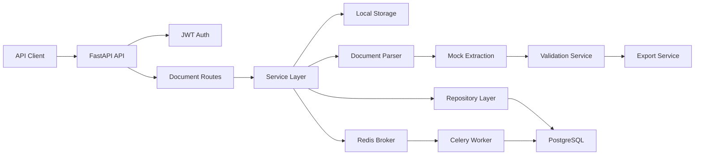
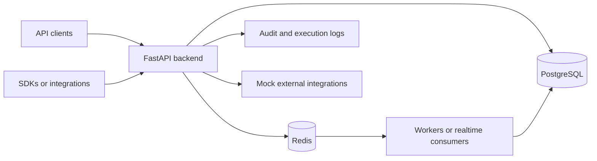
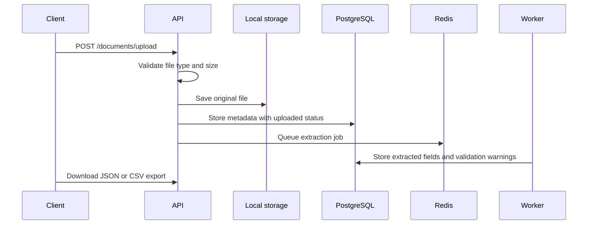

# AI Document Processing API

[](https://www.python.org/)
[](https://fastapi.tiangolo.com/)
[](https://www.postgresql.org/)
[](https://redis.io/)
[](https://github.com/SpyloDEV/ai-document-processing-api/actions/workflows/ci.yml)

A production-style backend API for AI-assisted document processing. The service lets users upload invoices, receipts, contracts, PDFs, images, CSV files, or text documents, then runs an extraction pipeline that parses content, produces structured fields, validates missing or risky data, and exports clean JSON or CSV results.

The extraction layer is intentionally mock-based, so the project runs locally and in CI without paid API keys. The architecture is ready for a real OCR, LLM, or document intelligence provider later.

## Features

- JWT authentication with registration, login, password hashing, and current-user lookup
- File upload for PDF, PNG, JPG, JPEG, CSV, and TXT files
- Local file storage with PostgreSQL metadata
- File type and size validation
- Document status tracking: `uploaded`, `processing`, `completed`, `failed`
- Redis/Celery background processing
- Synchronous processing fallback for tests and local development
- Clean extraction pipeline: parser, extraction service, validation service, export service
- Mock extraction for invoices and CSV-like tabular data
- Validation warnings, missing-field tracking, and confidence scores
- JSON and CSV export endpoints
- User-level document access control
- Pagination and status filtering for document lists
- Alembic migrations, Docker Compose, pytest, Ruff, Black, and GitHub Actions CI

## Architecture Overview



The code is split into production-style layers:

- `app/api/routes`: HTTP routes and response contracts
- `app/core`: settings, logging, security, and error handling
- `app/db`: async SQLAlchemy engine and sessions
- `app/models`: SQLAlchemy domain models
- `app/repositories`: database access
- `app/schemas`: Pydantic request and response schemas
- `app/services`: business logic and processing pipeline
- `app/workers`: Celery app and background jobs
- `app/utils`: file validation helpers
- `tests`: API-level regression tests

## Tech Stack

- Python 3.11+
- FastAPI
- PostgreSQL
- SQLAlchemy 2.0 async ORM
- Alembic
- Redis
- Celery
- Pydantic
- JWT with `python-jose`
- Passlib and bcrypt password hashing
- Pytest and HTTPX
- Ruff and Black
- Docker and Docker Compose
- GitHub Actions

## API Endpoints

| Method | Endpoint | Description |
| --- | --- | --- |
| `POST` | `/api/v1/auth/register` | Register a user |
| `POST` | `/api/v1/auth/login` | Login and receive a JWT |
| `GET` | `/api/v1/auth/me` | Get the current user |
| `POST` | `/api/v1/documents/upload` | Upload a document |
| `GET` | `/api/v1/documents` | List documents with pagination and filters |
| `GET` | `/api/v1/documents/{id}` | Get document metadata |
| `GET` | `/api/v1/documents/{id}/result` | Get extracted structured data |
| `GET` | `/api/v1/documents/{id}/validation` | Get validation results |
| `GET` | `/api/v1/documents/{id}/export/json` | Export extracted data as JSON |
| `GET` | `/api/v1/documents/{id}/export/csv` | Export extracted data as CSV |
| `DELETE` | `/api/v1/documents/{id}` | Delete a document |

## Local Setup

Create a virtual environment:

```bash
python -m venv .venv
source .venv/bin/activate
```

Install dependencies:

```bash
pip install -e ".[dev]"
```

Create an environment file:

```bash
cp .env.example .env
```

Set a strong local secret:

```bash
SECRET_KEY=$(openssl rand -hex 32)
```

Run migrations:

```bash
make migrate
```

Start the API:

```bash
uvicorn app.main:app --reload
```

Open the docs:

- Swagger UI: http://localhost:8000/docs
- ReDoc: http://localhost:8000/redoc
- Health check: http://localhost:8000/health

## Docker Setup

Create `.env`, then start the full stack:

```bash
cp .env.example .env
make dev
```

Set `SECRET_KEY` in `.env` before using the stack outside local development.

Docker Compose starts:

- FastAPI API on http://localhost:8000
- PostgreSQL on `localhost:5432`
- Redis on `localhost:6379`
- Celery worker for document processing

## API Examples

### Register

```bash
curl -X POST http://localhost:8000/api/v1/auth/register \
  -H "Content-Type: application/json" \
  -d '{
    "email": "analyst@example.com",
    "password": "strong-password",
    "full_name": "Document Analyst"
  }'
```

### Upload a Document

```bash
curl -X POST http://localhost:8000/api/v1/documents/upload \
  -H "Authorization: Bearer $TOKEN" \
  -F "file=@invoice-1001.txt"
```

### List Completed Documents

```bash
curl "http://localhost:8000/api/v1/documents?status=completed&limit=20&offset=0" \
  -H "Authorization: Bearer $TOKEN"
```

### Export CSV

```bash
curl http://localhost:8000/api/v1/documents/$DOCUMENT_ID/export/csv \
  -H "Authorization: Bearer $TOKEN"
```

## Example Extracted Result

```json
{
  "document_type": "invoice",
  "vendor_name": "Northwind Supplies",
  "customer_name": "Acme GmbH",
  "invoice_number": "INV-1001",
  "invoice_date": "2026-04-15",
  "due_date": "2026-05-15",
  "total_amount": 119.0,
  "currency": "EUR",
  "tax_amount": 19.0,
  "line_items": [
    {
      "description": "Detected document services",
      "quantity": 1.0,
      "unit_price": null,
      "amount": null
    }
  ],
  "confidence_score": 0.9
}
```

## Validation Example

```json
{
  "is_valid": true,
  "missing_fields": [],
  "warnings": [],
  "confidence_score": 0.9
}
```

## Commands

```bash
make dev      # Start API, Postgres, Redis, and worker
make test     # Run pytest
make lint     # Run Ruff and Black checks
make format   # Format code
make migrate  # Apply Alembic migrations
```

## Testing

Run all tests:

```bash
make test
```

Run quality checks:

```bash
make lint
```

The test suite covers authentication, upload validation, document listing, permissions, extraction results, and JSON/CSV exports.

## Why This Is Valuable For Companies

Many companies still process operational documents manually: invoices, contracts, receipts, CSV exports, onboarding forms, purchase orders, and compliance files. A service like this gives startups a practical foundation for automating intake, extracting structured data, validating quality, and integrating clean results into accounting, CRM, ERP, or analytics workflows.

This project demonstrates the backend pieces needed for that kind of product: secure users, durable metadata, async processing, extensible extraction services, validation feedback, exports, tests, migrations, CI, and containerized infrastructure.

## Security Notes

- Passwords are hashed before storage.
- JWT secrets come from environment variables.
- Document endpoints are protected by JWT auth.
- Users can only access their own documents.
- Uploaded files are validated by extension, content type, and size.
- `.env.example` is a template only; real secrets should never be committed.

<!-- lead-level-notes:start -->

## Lead-Level Architecture Notes

### Problem

Document-heavy teams need to ingest invoices, receipts, contracts, PDFs, images, and CSV files without manually copying data into downstream systems. The hard part is not only extraction, but tracking processing state, validation quality, exportability, and ownership of uploaded documents.

### Solution

The API accepts document uploads, stores metadata, runs a mock AI extraction pipeline in the background, validates extracted fields, and exposes JSON or CSV exports. The parser/extraction/validation/export services are separated so a real OCR or LLM provider can replace the mock implementation without rewriting routes.

### Architecture Overview

This is a portfolio/simulation project, but it is structured around the same boundaries a production team would care about:

- Frontend/client: External clients or frontend apps.
- Backend API: FastAPI routes stay thin and delegate business rules to services.
- Database: PostgreSQL is the source of truth for relational state, ownership, and auditability.
- Redis: Used where the project needs queues, Pub/Sub, cache-ready paths, or rate-limit-ready primitives.
- Background jobs: Uploads return quickly while extraction runs out of band. Failed jobs mark documents as failed and keep enough state for retry or support inspection.
- Integrations: Mock providers are kept behind service boundaries so real vendors can be added without changing API contracts.
- Runtime flow: Requests validate identity and tenant access first, then call services that persist state, emit logs, and enqueue async work when needed.

Key components:

- FastAPI upload and result API
- Local storage folder for uploaded files
- PostgreSQL for metadata, processing state, extracted results, and validation warnings
- Redis broker plus worker for async extraction
- Mock AI extraction service with provider boundary
- JWT ownership checks for document access

### Mermaid Diagrams

#### System Overview



#### Document Processing Flow



### Lead-Level Engineering Decisions

- FastAPI keeps the API surface explicit, typed, and easy to document through OpenAPI.
- PostgreSQL is used for durable relational state because the core domain depends on ownership, filtering, constraints, and audit history.
- Service and repository layers keep route handlers small and make permission checks, workflows, and business rules easier to test.
- Redis is used for lightweight async coordination, Pub/Sub, cache-ready access patterns, or rate limiting depending on the product shape.
- Pydantic schemas define clear input/output contracts and avoid leaking ORM details into HTTP responses.
- Docker Compose keeps the local runtime close to a real deployment without hiding the moving parts.
- The project would need Kafka or another event stream when message volume, replay, ordering, or cross-service consumers outgrow Redis queues or Pub/Sub.
- Kubernetes would make sense once multiple API/worker replicas, autoscaling, secrets management, and rollout strategy become operational concerns.
- Object storage becomes necessary when user-uploaded files, exports, or artifacts should not live on local disk.

### Production Considerations

- Rate limiting should be applied to authentication, public ingestion, webhook, and API-key protected endpoints.
- Important POST endpoints should support idempotency keys when clients may retry after timeouts.
- Workers should record retry attempts, terminal failures, and enough context for support/debugging.
- Structured logging should include request IDs, actor IDs, tenant/workspace IDs, and resource IDs where safe.
- Health checks should distinguish process health from dependency readiness for database, Redis, and workers.
- Error responses should stay consistent and avoid leaking internal exception details.
- Pagination and filtering should be mandatory for list endpoints that can grow with customer usage.
- Validation should happen at the API boundary and again inside domain services for sensitive state transitions.
- Audit logs should be append-only from the application's point of view and easy to filter by actor/action/resource.

### Security Considerations

- JWT secrets and database credentials belong in environment variables or a secret manager, never in source code.
- Passwords should be hashed with a slow password hashing algorithm and never logged.
- API keys should be shown only once, stored hashed, scoped to the smallest useful surface, and revocable.
- RBAC or workspace membership checks should happen before returning or mutating tenant-owned resources.
- Tenant/workspace isolation should be tested with explicit cross-tenant access attempts.
- Input validation should cover request bodies, path parameters, uploaded files, and integration payloads.
- Safe defaults matter: deny by default, keep production actions stricter, and prefer explicit allow lists.
- The most important security boundary in this project is file validation and per-user document access.

### Observability

- Request logs should capture method, path, status, latency, and correlation ID.
- Domain logs should capture state transitions such as queued, processing, completed, failed, revoked, or retried.
- Audit logs explain who changed what and when.
- Metrics/analytics endpoints provide a product-facing view of usage, failure rates, and operational health.
- `/health` gives a basic load balancer check; production would add dependency checks and build/version metadata.
- Error tracking can be mocked locally, but production should send exceptions to Sentry or a similar system.
- Realtime log streams, where present, are for operator feedback and should not replace persisted logs.

### Scaling Strategy

- MVP: one API instance, one PostgreSQL database, one Redis instance, and one worker process is enough to validate the product shape.
- Next step: run multiple API replicas, separate worker queues by workload, and add indexes for tenant ID, status, timestamps, and foreign keys.
- Caching: cache read-heavy reference data carefully and keep invalidation tied to writes or versioned configs.
- Queues: keep short jobs on Redis; move to Kafka, Redpanda, or a managed queue when replay, ordering, or long retention are needed.
- Database: use connection pooling, query plans, and read replicas before introducing unnecessary data stores.
- Horizontal scaling should preserve tenant isolation, idempotency, and clear ownership of background jobs.
- This system would most likely need a stronger event backbone when large file volume, OCR latency, or multi-tenant storage needs.

### Future Improvements

- Move file storage to S3 or GCS with signed URLs
- Add OCR provider adapters and confidence calibration
- Add idempotency keys for repeated uploads from email/webhooks
- Kubernetes manifests or Helm charts once runtime topology matters.
- OpenTelemetry traces across API, workers, database calls, and external integrations.
- Sentry or another error tracker for production exception triage.
- Prometheus and Grafana dashboards for latency, queue depth, throughput, and failure rates.
- More contract and integration tests around permission boundaries and failure paths.

<!-- lead-level-notes:end -->
