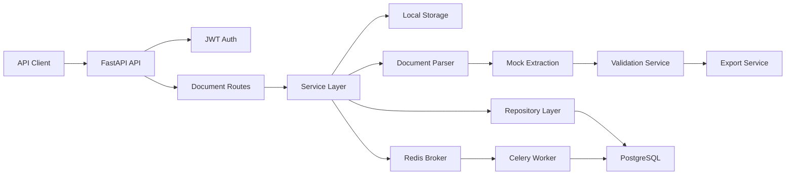

# AI Document Processing API

[](https://www.python.org/)
[](https://fastapi.tiangolo.com/)
[](https://www.postgresql.org/)
[](https://redis.io/)
[](https://github.com/SpyloDEV/ai-document-processing-api/actions/workflows/ci.yml)

A production-style backend API for AI-assisted document processing. The service lets users upload invoices, receipts, contracts, PDFs, images, CSV files, or text documents, then runs an extraction pipeline that parses content, produces structured fields, validates missing or risky data, and exports clean JSON or CSV results.

The extraction layer is intentionally mock-based, so the project runs locally and in CI without paid API keys. The architecture is ready for a real OCR, LLM, or document intelligence provider later.

## Features

- JWT authentication with registration, login, password hashing, and current-user lookup
- File upload for PDF, PNG, JPG, JPEG, CSV, and TXT files
- Local file storage with PostgreSQL metadata
- File type and size validation
- Document status tracking: `uploaded`, `processing`, `completed`, `failed`
- Redis/Celery background processing
- Synchronous processing fallback for tests and local development
- Clean extraction pipeline: parser, extraction service, validation service, export service
- Mock extraction for invoices and CSV-like tabular data
- Validation warnings, missing-field tracking, and confidence scores
- JSON and CSV export endpoints
- User-level document access control
- Pagination and status filtering for document lists
- Alembic migrations, Docker Compose, pytest, Ruff, Black, and GitHub Actions CI

## Architecture Overview



The code is split into production-style layers:

- `app/api/routes`: HTTP routes and response contracts
- `app/core`: settings, logging, security, and error handling
- `app/db`: async SQLAlchemy engine and sessions
- `app/models`: SQLAlchemy domain models
- `app/repositories`: database access
- `app/schemas`: Pydantic request and response schemas
- `app/services`: business logic and processing pipeline
- `app/workers`: Celery app and background jobs
- `app/utils`: file validation helpers
- `tests`: API-level regression tests

## Tech Stack

- Python 3.11+
- FastAPI
- PostgreSQL
- SQLAlchemy 2.0 async ORM
- Alembic
- Redis
- Celery
- Pydantic
- JWT with `python-jose`
- Passlib and bcrypt password hashing
- Pytest and HTTPX
- Ruff and Black
- Docker and Docker Compose
- GitHub Actions

## API Endpoints

| Method | Endpoint | Description |
| --- | --- | --- |
| `POST` | `/api/v1/auth/register` | Register a user |
| `POST` | `/api/v1/auth/login` | Login and receive a JWT |
| `GET` | `/api/v1/auth/me` | Get the current user |
| `POST` | `/api/v1/documents/upload` | Upload a document |
| `GET` | `/api/v1/documents` | List documents with pagination and filters |
| `GET` | `/api/v1/documents/{id}` | Get document metadata |
| `GET` | `/api/v1/documents/{id}/result` | Get extracted structured data |
| `GET` | `/api/v1/documents/{id}/validation` | Get validation results |
| `GET` | `/api/v1/documents/{id}/export/json` | Export extracted data as JSON |
| `GET` | `/api/v1/documents/{id}/export/csv` | Export extracted data as CSV |
| `DELETE` | `/api/v1/documents/{id}` | Delete a document |

## Local Setup

Create a virtual environment:

```bash
python -m venv .venv
source .venv/bin/activate
```

Install dependencies:

```bash
pip install -e ".[dev]"
```

Create an environment file:

```bash
cp .env.example .env
```

Set a strong local secret:

```bash
SECRET_KEY=$(openssl rand -hex 32)
```

Run migrations:

```bash
make migrate
```

Start the API:

```bash
uvicorn app.main:app --reload
```

Open the docs:

- Swagger UI: http://localhost:8000/docs
- ReDoc: http://localhost:8000/redoc
- Health check: http://localhost:8000/health

## Docker Setup

Create `.env`, then start the full stack:

```bash
cp .env.example .env
make dev
```

Set `SECRET_KEY` in `.env` before using the stack outside local development.

Docker Compose starts:

- FastAPI API on http://localhost:8000
- PostgreSQL on `localhost:5432`
- Redis on `localhost:6379`
- Celery worker for document processing

## API Examples

### Register

```bash
curl -X POST http://localhost:8000/api/v1/auth/register \
  -H "Content-Type: application/json" \
  -d '{
    "email": "analyst@example.com",
    "password": "strong-password",
    "full_name": "Document Analyst"
  }'
```

### Upload a Document

```bash
curl -X POST http://localhost:8000/api/v1/documents/upload \
  -H "Authorization: Bearer $TOKEN" \
  -F "file=@invoice-1001.txt"
```

### List Completed Documents

```bash
curl "http://localhost:8000/api/v1/documents?status=completed&limit=20&offset=0" \
  -H "Authorization: Bearer $TOKEN"
```

### Export CSV

```bash
curl http://localhost:8000/api/v1/documents/$DOCUMENT_ID/export/csv \
  -H "Authorization: Bearer $TOKEN"
```

## Example Extracted Result

```json
{
  "document_type": "invoice",
  "vendor_name": "Northwind Supplies",
  "customer_name": "Acme GmbH",
  "invoice_number": "INV-1001",
  "invoice_date": "2026-04-15",
  "due_date": "2026-05-15",
  "total_amount": 119.0,
  "currency": "EUR",
  "tax_amount": 19.0,
  "line_items": [
    {
      "description": "Detected document services",
      "quantity": 1.0,
      "unit_price": null,
      "amount": null
    }
  ],
  "confidence_score": 0.9
}
```

## Validation Example

```json
{
  "is_valid": true,
  "missing_fields": [],
  "warnings": [],
  "confidence_score": 0.9
}
```

## Commands

```bash
make dev      # Start API, Postgres, Redis, and worker
make test     # Run pytest
make lint     # Run Ruff and Black checks
make format   # Format code
make migrate  # Apply Alembic migrations
```

## Testing

Run all tests:

```bash
make test
```

Run quality checks:

```bash
make lint
```

The test suite covers authentication, upload validation, document listing, permissions, extraction results, and JSON/CSV exports.

## Why This Is Valuable For Companies

Many companies still process operational documents manually: invoices, contracts, receipts, CSV exports, onboarding forms, purchase orders, and compliance files. A service like this gives startups a practical foundation for automating intake, extracting structured data, validating quality, and integrating clean results into accounting, CRM, ERP, or analytics workflows.

This project demonstrates the backend pieces needed for that kind of product: secure users, durable metadata, async processing, extensible extraction services, validation feedback, exports, tests, migrations, CI, and containerized infrastructure.

## Security Notes

- Passwords are hashed before storage.
- JWT secrets come from environment variables.
- Document endpoints are protected by JWT auth.
- Users can only access their own documents.
- Uploaded files are validated by extension, content type, and size.
- `.env.example` is a template only; real secrets should never be committed.
